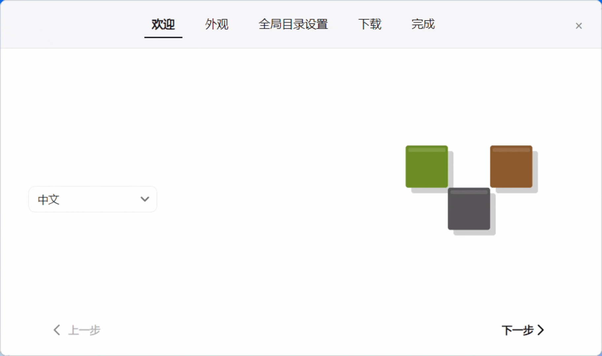

# LauncherGo

LauncherGo 是一个基于 `Avalonia 12 + Semi.Avalonia` 的 Vintage Story 服务器启动器项目。  
当前仓库阶段以“初次启动指导窗口”功能为主。

## 界面预览



## 当前状态

- 已实现：首次启动指导窗口（欢迎、外观、全局目录设置、下载、完成）
- 已实现：中英文切换、主题切换、目录选择、服务端版本下载与导入
- 正在完善：后续完整启动器功能

## 项目结构

- `LauncherGo.App`：应用入口与宿主
- `LauncherGo.Ui`：Avalonia 界面层
- `LauncherGo.Services`：服务实现（下载、配置等）
- `LauncherGo.Abstractions`：接口抽象
- `LauncherGo.Domains`：领域模型与枚举

## 开发环境

- `.NET SDK 10.0+`
- Windows/macOS/Linux（Avalonia 跨平台）

## 快速启动

```powershell
dotnet restore .\LauncherGo.slnx
dotnet run --project .\LauncherGo.App\LauncherGo.App.csproj
```

## 热重载（开发）

```powershell
dotnet watch run --project .\LauncherGo.App\LauncherGo.App.csproj
```

如果热重载时出现程序集被占用，先结束正在运行的 `LauncherGo.App` 进程后再重试。

## 许可证

本项目使用 `GNU General Public License v3.0`（GPL-3.0），详见 [LICENSE](./LICENSE)。
